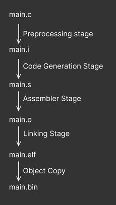

# Bare metal learning

## Makefile
Makefile is a way to organize commands to execute to build or compile. Using variables and recipies we can easily reuse commands in a understandable way.

## Compilation Process
The compilation in done in many steps. Below image describes the stages in brief:



## Compiler Argument Explanation
Here `armcc = arm-none-eabi-gcc`. I used it as an alias in my bash profile.
- `-c`: Compile and assemble but do not link. Skip the linking stage.
example: `armcc -c main.c -o main.o`

- `-mcpu=<processor name>`: Name of the target processor's name. example: `-mcpu=cortex-m4`, `-mcpu=arm8`
- `-mthumb`: If specified the generating code will be excecuted in thumb state. `-marm` would do it in arm state.
- `-std=<language standard>`: Determine the language standard. example: `-std=gnu11`, `-std=c17`
- `-O0`: Reduces compilation time and makes debugging produce the expected results.
- `-Wall`: This will turn on all the warnings.

## Linker Argument Explanation
- `-T <script file>`: use the script file as the linker script. example: `armcc -T stm32_ls.ld main.o -o final.elf`
- `Wl, <options>`: To pass linker specific options. `arm-none-eabi-gcc` will pass the options to linker. Example: `-Wl, -Map=final.map`
- `-nostdlib`: If specified linker will not link any standard libraries.
- `--specs=<file>`: Link with specific spec file. Do not use `-nostdlib` if using this argument. AAAAAAAAA

## Object file analyze
`arm-none-eabi-objdump` command displays information from object files.
useage:
-	`objdump -h main.o` will show the contents of header sections,
- `objdump -d main.o` will show the assembler contents of excecutable sections mainly disassembly of .text sections,
- `objdump -s main.o` will intermix source code with disassembly
- `objdump -D main.o` will show the assembler contents of all sections.

Elf file format detail: [In-depth: ELF - The Extensible & Linkable Format](https://www.youtube.com/watch?v=nC1U1LJQL8o)

## Sections
Sections are different regions of memory. Each region holds different kinds of data. Commonly seen sections are:
1. **isr_vector**: The `isr_vector` section is where the vector table is defined. So at the time of interrupt the microprocessor will know where to go.
2. **text**: The `text` section is where the excecutable instructions are stored. This is where the code live. So that the debugger knows where to start the program etc.
3. **bss**: This is where the uninitialized global or static data will be stored. For example emtpy variables or empty arrays. bss is a abbreviation for block starting symbol.
4. **data**: `.data` sections holds the global variables.
5. **rodata**: `.rodata` section contains the constants which are read-only.


## Linking Script Explanation

- **ENTRY Command**: This command sets entry point information in the header of final elf file. Example: `ENTRY(Reset_Handler)`
- **MEMORY Command**: This command describes different memory location of target and their start address and length. Linker uses this information to assign addresses to sections. Example:
```
MEMORY {
	Flash(rw): ORIGIN=0x08000000, LENGTH=512K
}
```
- **SECTIONS Command**: This command is used to create different output sections in the final elf file. With this command we merge different input sections into an output section. It also controls the order in which sections will appear. We also define the output section's address. Example:
```
SECTIONS {
	.data :
		{
			_sdata = .;
		*(.data)
		*(.data.*)

		. = ALIGN(4);
		_edata = .;
		}> SRAM AT> FLASH
}
```
- **Location Counter**: `.` (dot) represents a location counter. This is a special linker script vairable. This holds the address of current location. It is writable. Example: `_start_of_data = .` it will assign the variable _start_of_data to current location.
- **ALIGN command**: This command align the current address with specified word boundary. Usage: `. = ALIGN(4)` it will align the current address to word boundary, i.e, the address will be multiple of 4. 